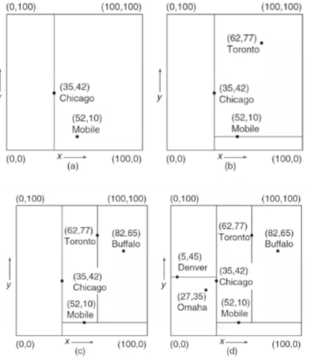
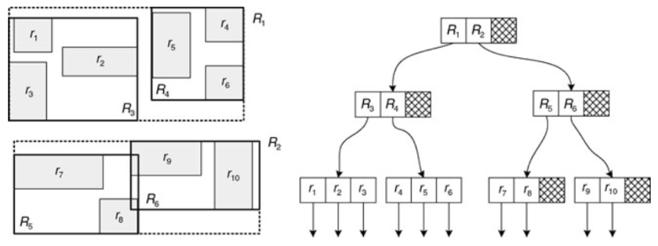
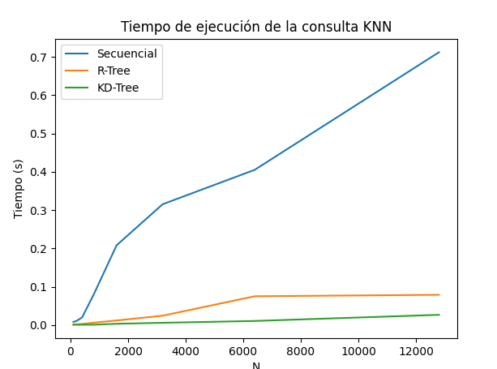

# bd2-p3-backend

## Librerías utilizadas

- `django` para el backend y `djangorestframework` para la API
- `RTree` para el manejo de los índices espaciales utilizando un R-Tree. El knn se implementa utilizando un R-Tree con un MBR de cada punto y el algoritmo de búsqueda de vecinos más cercanos de RTree. Soporta busqueda de vecinos más cercanos y búsqueda de vecinos más cercanos por rango.
- `Scikit-learn` para el manejo de los índices espaciales utilizando un KD-Tree. Soporta busqueda de vecinos más cercanos y búsqueda por rango.
  
## Estrucutra de datos
- *KD-Tree*: El árbol K-dimensional es una estructura que busca dividir el espacio en subplanos en función de los datos, lo que lo convierte en una estructura Data Driven. Sin embargo, a medida que aumentan las dimensiones, su rendimiento disminuye considerablemente. Además, el resultado obtenido puede variar según el orden en que se inserten los datos, lo que puede llevar a un desequilibrio en el árbol. Para superar estas limitaciones, es posible utilizar diferentes formas de dividir los datos, como por ejemplo, aplicando derivaciones al árbol K-dimensional y cambiando la forma en que se realizan las divisiones.
  
    

- *R-Tree*: El R-Tree es una estructura de datos similar al B+ Tree. Es un árbol autobalanceado que crece de abajo hacia arriba, y los datos se almacenan en las hojas del árbol. Cada nodo del R-Tree debe contener al menos el piso del orden dividido por 2 elementos. A diferencia del B+ Tree, en el R-Tree la cantidad de hijos de un nodo es igual a la cantidad de regiones definidas, sin tener un hijo adicional que sea mayor que todos los demás como en el B+ Tree.
    

## Algoritmo
### Creación de los índices espaciales
La creación de los índices espaciales se realiza al iniciar el servidor de Django si es que no se encuentran ya creados.

- `Secuencial`: Se carga el conjunto de datos desde archivos, se genera el vector de cada imagen y se almacena en una base de datos SQL junto con el nombre de la imagen.
- `R-Tree`: Se carga el conjunto de vectores desde la base de datos utilizando un ORM,  se crea un R-Tree con los vectores y se almacena en un archivo utilizando una funcionalidad de la misma librería.
- `KD-Tree`: Se carga el conjunto de vectores desde la base de datos utilizando un ORM,  se crea un KD-Tree con los vectores utilizando la librería de Scikit-learn y se almacena en un archivo utilizando la librería de Pickle.

### Búsqueda de vecinos más cercanos

- *Secuencial*: Se carga la imagen, extrae un vector de características de la cara y luego realiza cálculos de distancia entre ese vector y los vectores de características almacenados en una base de datos. Utiliza una estructura de montón (heap) para almacenar y mantener los k vectores más cercanos, reemplazando los más distantes a medida que se encuentran distancias más pequeñas. Finalmente, devuelve una respuesta que incluye el tiempo de ejecución y los k vecinos más cercanos junto con sus distancias.

```less
heap = []
for face_vector in queryset:
    vector = face_vector.vector
    vector = convert_to_float64(remove_brackets(vector))

    if distance_metric == "euclidean":
        distance = calculate_euclidean_distance(vector, query_vector)
    elif distance_metric == "manhattan":
        distance = calculate_manhattan_distance(vector, query_vector)
    elif distance_metric == "cosine":
        distance = calculate_cosine_similarity(vector, query_vector)
    else:
        distance = calculate_default_distance(vector, query_vector)

    if length(heap) < k:
        heap.append((distance, face_vector))
    else:
        max_distance = max(heap, key=lambda x: x[0])
        if distance < max_distance[0]:
            heap.remove(max_distance)
            heap.append((distance, face_vector))
```

- *KD-Tree*: Se inicia desde la raíz del KD-Tree y se desciende por los subplanos según la ubicación del punto de consulta en cada dimensión. Se actualizan y almacenan los k vecinos más cercanos encontrados hasta el momento, descartando subárboles que no contengan puntos más cercanos. Al finalizar, se devuelve el conjunto de k vecinos encontrados, representando los puntos más cercanos al punto de consulta en el espacio k-dimensional.

- *R-Tree*: Se desciende por los nodos del árbol evaluando la intersección de las regiones con el punto de consulta y descartando aquellos nodos que no pueden contener vecinos más cercanos. Los k vecinos más cercanos se actualizan y mantienen en cada nodo visitado. Al finalizar, se devuelve el conjunto de k vecinos encontrados como resultado de la búsqueda en el R-Tree.

  


## Análisis de maldición de la dimensionalidad

La maldición de la dimensionalidad es un fenómeno que ocurre cuando se trabaja con datos de alta dimensionalidad, en donde la distancia entre los puntos se vuelve cada vez más grande a medida que aumenta la dimensionalidad. Esto se debe a que la cantidad de puntos que se encuentran a una distancia fija de un punto de referencia disminuye exponencialmente a medida que aumenta la dimensionalidad. Una solución a este problema es la reducción de dimensionalidad para poder trabajar con menos dimensiones y garantizar que las dimensiones restantes sean las más relevantes. Esto es lo que se aplica en el algoritmo de [PCA](https://es.wikipedia.org/wiki/An%C3%A1lisis_de_componentes_principales) o en los kernels convolucionales de las redes neuronales.

## Experimentación

<!-- table of 4 by 3 -->
| N | Secuencial (s) | R-Tree (s) | KD-Tree (s) |
| --- | --- | --- | --- |
| 100   | 0.008301921844482422 | 0.0010685920715332031 | 0.001184701919555664 |
| 200   | 0.010561704635620117 | 0.002147674560546875 | 0.0009965896606445312 |
| 400   | 0.01990342140197754 | 0.0028946399688720703 | 0.0009989738464355469 |
| 800   | 0.07903051376342773 | 0.006285429000854492 | 0.0010077953338623047 |
| 1600  | 0.2081339359283447 | 0.0120849609375 | 0.0035161972045898438 |
| 3200  | 0.31534457206726074 | 0.024543046951293945 | 0.006022214889526367 |
| 6400  | 0.4052000011222232 | 0.07526922225952148 | 0.01079106330871582 |
| 12800 | 0.7119498252868652 | 0.07902193069458008 | 0.026833057403564453 |

  


Se realizaron 4 experimentos por cada N, y se tomó el promedio de los tiempos par cada algoritmo. Se puede observar que el algoritmo secuencial es el más lento, y que el R-Tree y el KD-Tree son ambos más rápidos que el algoritmo secuencial. Esto se puede deber a que el R-Tree tiene peor performance cuando los datos están mucho más dispersos. En este caso, considerando que cerca del 95% de las carpetas cuentan con 1 archivo los vectores del conjunto serán sumamente diferentes entre sí, lo que provoca que estén más dispersos en conjunto, por lo que el R-Tree no tendrá un buen desempeño. Por otro lado, el KD-Tree tiene mejor desempeño cuando los datos están más dispersos, por lo que en este caso tiene mejor desempeño que el R-Tree.

