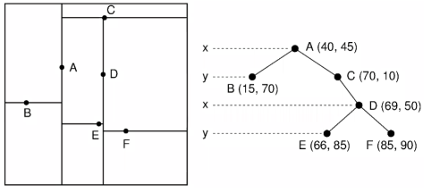

# bd2-p3-backend

## Librerías utilizadas

- `django` para el backend y `djangorestframework` para la API
- `RTree` para el manejo de los índices espaciales utilizando un R-Tree. El knn se implementa utilizando un R-Tree con un MBR de cada punto y el algoritmo de búsqueda de vecinos más cercanos de RTree. Soporta busqueda de vecinos más cercanos y búsqueda de vecinos más cercanos por rango.
- `Scikit-learn` para el manejo de los índices espaciales utilizando un KD-Tree. Soporta busqueda de vecinos más cercanos y búsqueda por rango.
  
   

## Análisis de maldición de la dimensionalidad

La maldision de la dimensionalidad es un fenómeno que ocurre cuando se trabaja con datos de alta dimensionalidad, en donde la distancia entre los puntos se vuelve cada vez más grande a medida que aumenta la dimensionalidad. Esto se debe a que la cantidad de puntos que se encuentran a una distancia fija de un punto de referencia disminuye exponencialmente a medida que aumenta la dimensionalidad. Una solución a este problema es la reducción de dimensionalidad para poder trabajar con menos dimensiones y garantizar que las dimensiones restantes sean las más relevantes. Esto es lo que se aplica en el algoritmo de [PCA](https://es.wikipedia.org/wiki/An%C3%A1lisis_de_componentes_principales) o en los kernels convolucionales de las redes neuronales.

## Experimentación

<!-- table of 4 by 3 -->
| N | Secuencial (s) | R-Tree (s) | KD-Tree (s) |
| --- | --- | --- | --- |
| 100   | 0.008301921844482422 | 0.0010685920715332031 | 0.001184701919555664 |
| 200   | 0.010561704635620117 | 0.002147674560546875 | 0.0009965896606445312 |
| 400   | 0.01990342140197754 | 0.0028946399688720703 | 0.0009989738464355469 |
| 800   | 0.07903051376342773 | 0.006285429000854492 | 0.0010077953338623047 |
| 1600  | 0.2081339359283447 | 0.0120849609375 | 0.0035161972045898438 |
| 3200  | 0.31534457206726074 | 0.024543046951293945 | 0.006022214889526367 |
| 6400  | 0.4052000011222232 | 0.07526922225952148 | 0.01079106330871582 |
| 12800 | 0.7119498252868652 | 0.07902193069458008 | 0.026833057403564453 |

  

Se realizaron 4 experimentos por cada N, y se tomó el promedio de los tiempos par cada algoritmo. Se puede observar que el algoritmo secuencial es el más lento, y que el R-Tree y el KD-Tree son ambos más rápidos que el algoritmo secuencial. Esto se puede deber a que el R-Tree tiene peor performance cuando los datos están mucho más dispersos. En este caso, considerando que cerca del 95% de las carpetas cuentan con 1 archivo los vectores del conjunto serán sumamente diferentes entre sí, lo que provoca que estén más dispersos en conjunto, por lo que el R-Tree no tendrá un buen desempeño. Por otro lado, el KD-Tree tiene mejor desempeño cuando los datos están más dispersos, por lo que en este caso tiene mejor desempeño que el R-Tree.

